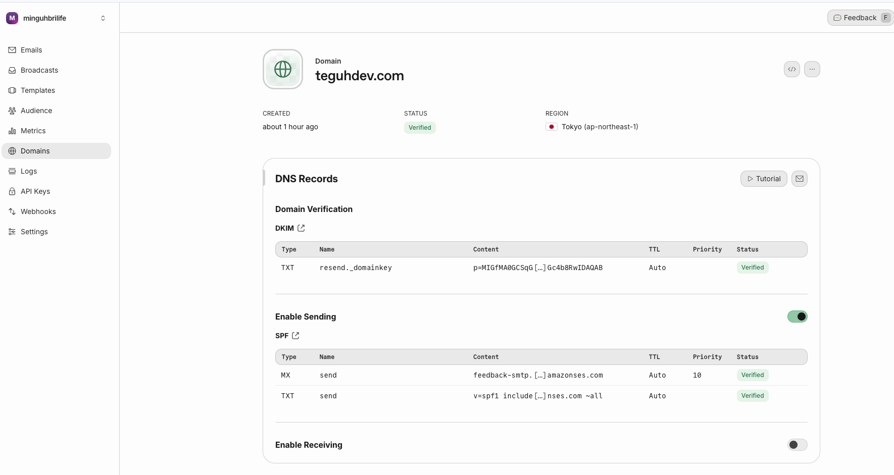
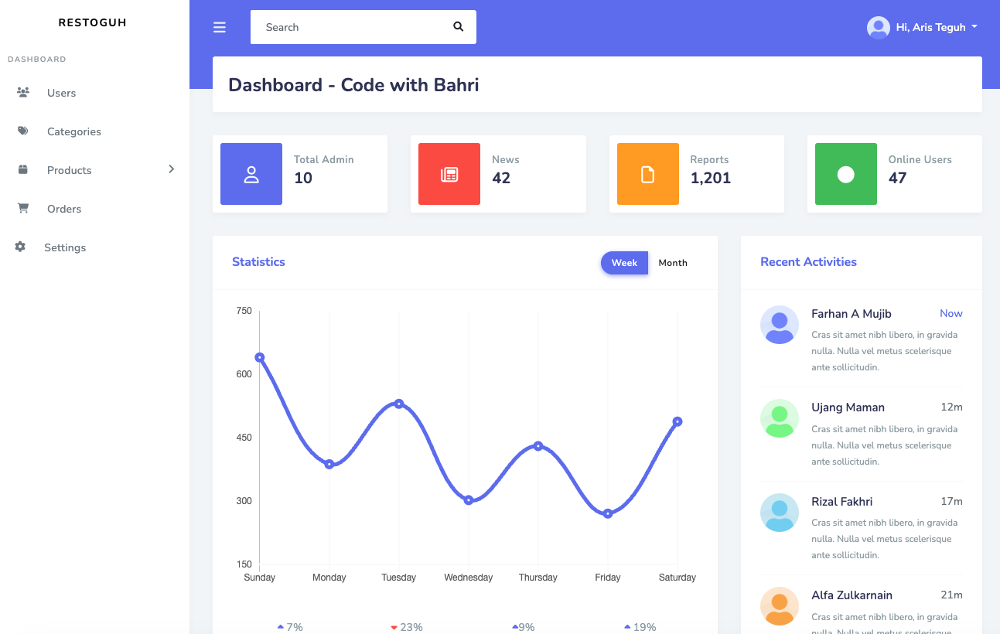
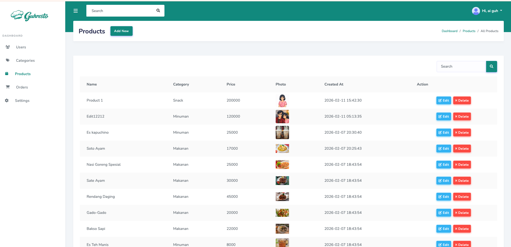
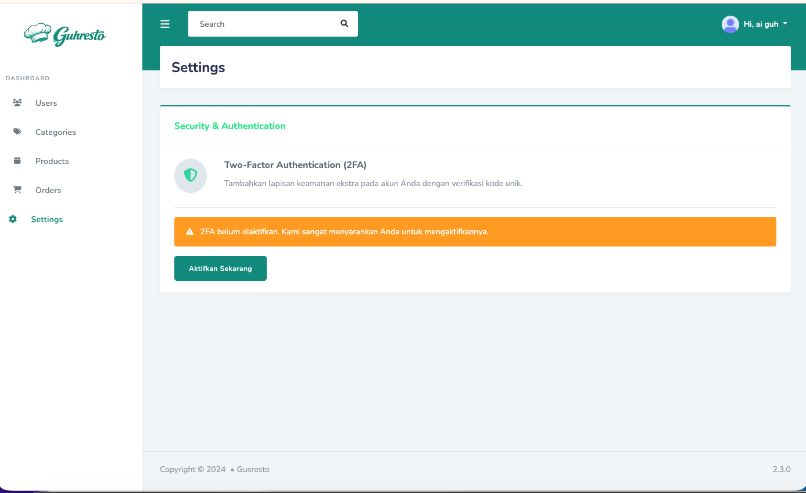
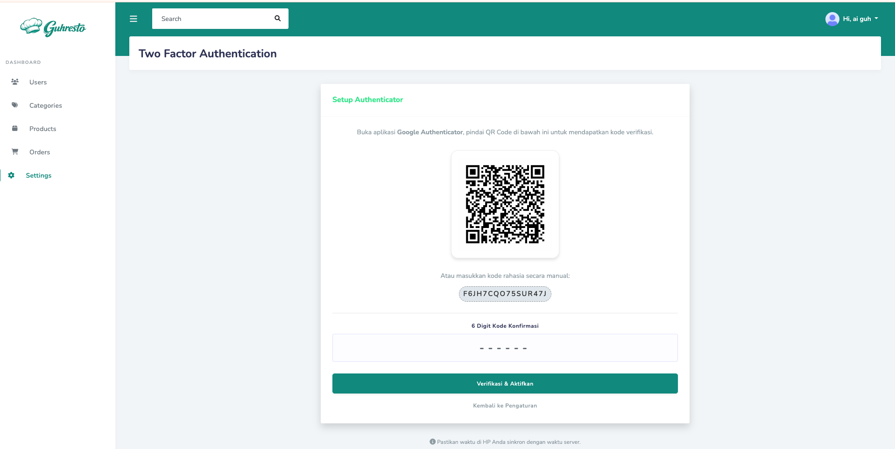
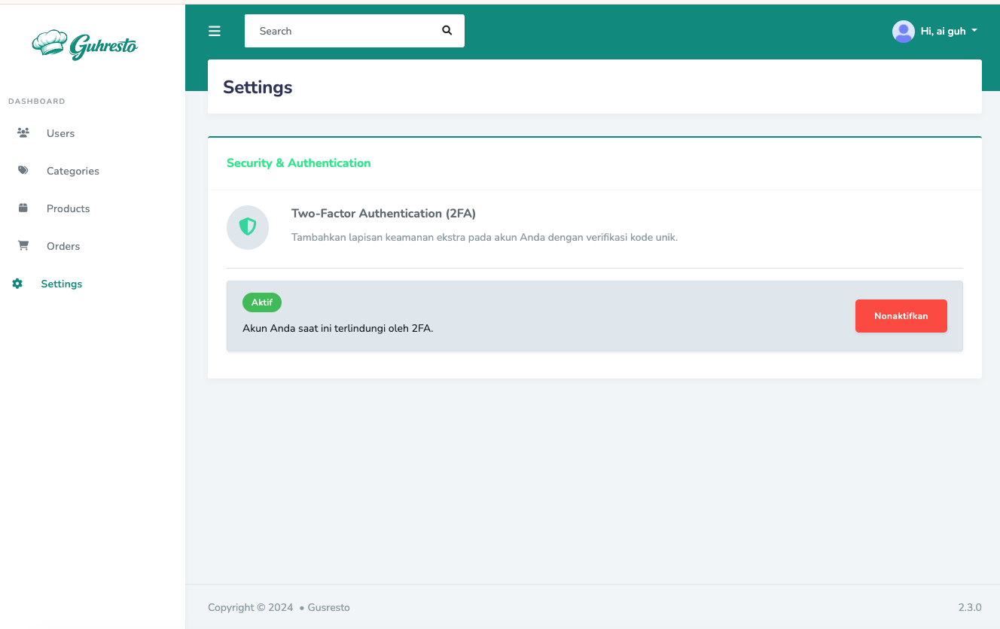
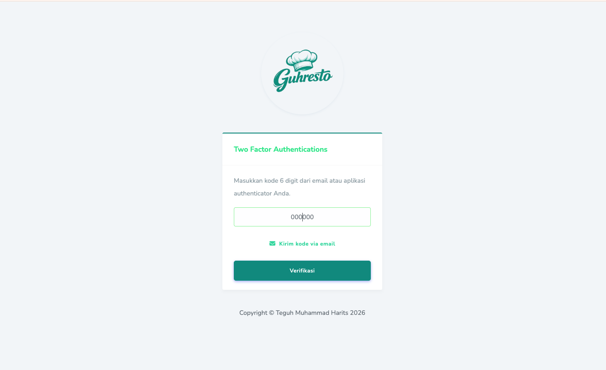
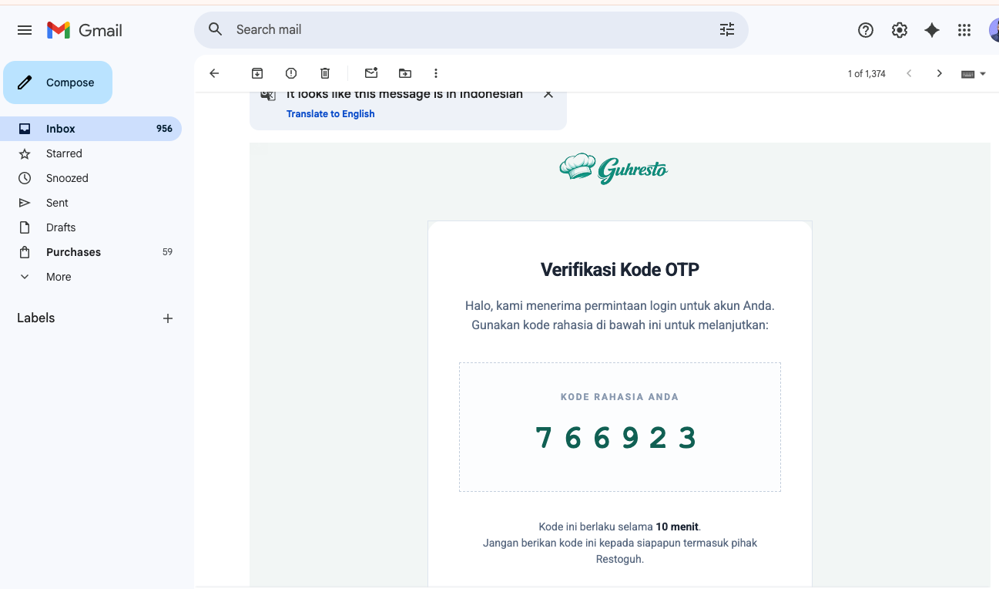

<div align="center">
  
</div>
🍴 Gusresto Backend

**Gusresto** adalah platform manajemen restoran berbasis Laravel 10 yang mencakup sistem Point of Sales (POS), manajemen inventaris, reservasi meja, hingga pelaporan keuangan. Sistem ini dilengkapi dengan keamanan ganda (2FA) dan integrasi penyimpanan cloud MinIO.


## 🚀 Fitur Utama

### 🔐 Authentication & Security
- Login & Register dengan Laravel Sanctum / JWT
- Login dengan Google OAuth
- Two Factor Authentication (2FA) via Email (OTP)
- Session Management & Secure Logout
- Role-Based Access Control (Admin, Kasir, Kitchen)
- CSRF Protection & Form Validation

---

### 🛒 POS (Point of Sales)
- Transaksi cepat untuk kasir
- Manajemen Produk & Kategori
- Manajemen Meja (Table Status: Available / Reserved / Occupied)
- Perhitungan otomatis total harga
- Status Order: Pending → Ready → Done
- Riwayat transaksi

---

### 🍽 Order & Kitchen Workflow
- Pemisahan akses:
  - Kasir: Input & kelola pesanan
  - Kitchen: Monitoring pesanan masuk
  - Admin: Kontrol penuh semua order
- Real-time order monitoring
- Update status langsung dari dapur
- Filter order berdasarkan status

---

### 📅 Reservation System
- Booking meja online
- Validasi ketersediaan meja
- Manajemen waktu reservasi
- Tracking status reservasi

---

### 📊 Reporting & Analytics
- Summary penjualan harian
- Produk terlaris
- Total revenue
- Laporan transaksi per periode
- Tutup kasir (closing shift report)

---


### ☁️ Cloud Storage Integration
- Integrasi MinIO (S3 Compatible)
- Upload & penyimpanan file produk
- Testing koneksi storage
- Environment-based configuration

---

### 📧 Email Integration (Resend SMTP)
- Pengiriman OTP 2FA via Email
- Konfigurasi SMTP Resend
- Notifikasi sistem berbasis email

---

### 🌍 Deployment & Production Ready
- Deployed di VPS (Linux)
- Nginx + PHP 8.x
- Domain custom
- Timezone Asia/Jakarta
- Environment Configuration (.env)
- Production Mode Ready


---

## 🌍 Live Deployment

- 🌐 Web App: http://teguhdev.space
- 🔗 API Base URL: http://teguhdev.space/api
- ☁️ MinIO Storage: http://minio.teguhdev.space:9000

### 1. Authentication
| Method | Endpoint | Deskripsi | Status |
| :--- | :--- | :--- | :--- |
| `POST` | `/login` | Login user & mendapatkan token | Public |
| `POST` | `/register` | Registrasi user baru | Public |
| `POST` | `/auth/google` | Login melalui Google Account | Public |
| `POST` | `/2fa/verify` | Verifikasi kode OTP 2FA | Public |
| `POST` | `/logout` | Menghapus session/token | Auth |

### 2. Product & Category
| Method | Endpoint | Deskripsi |
| :--- | :--- | :--- |
| `GET` | `/products` | List semua produk |
| `POST` | `/products` | Tambah produk baru |
| `PATCH` | `/products/{id}` | Update data produk |
| `GET` | `/categories` | List semua kategori |
| `GET` | `/list-categories` | List kategori singkat untuk dropdown |

### 3. Orders & Kitchen
| Method | Endpoint | Deskripsi |
| :--- | :--- | :--- |
| `POST` | `/orders` | Membuat pesanan baru |
| `GET` | `/my-orders` | Riwayat pesanan user saat ini |
| `GET` | `/admin/orders` | Semua data pesanan (Admin) |
| `GET` | `/kitchen/orders` | Monitoring pesanan untuk tim Dapur |
| `PATCH` | `/orders/{id}/status` | Update status pesanan (Pending/Ready/Done) |

### 4. Tables & Reservations
| Method | Endpoint | Deskripsi |
| :--- | :--- | :--- |
| `GET` | `/tables` | List status ketersediaan meja |
| `POST` | `/reservations` | Membuat reservasi meja baru |

---

## 🖥️ Dokumentasi Web (Admin Dashboard)

Dashboard Admin dapat diakses melalui browser untuk manajemen data master.

### Alur Kerja Utama:
1.  **Login**: User masuk melalui `/login`. Jika 2FA aktif, user diarahkan ke `/2fa-challenge`.
2.  **Dashboard**: Ringkasan performa restoran di `/home`.
3.  **User Management**: Pengelolaan hak akses karyawan melalui `/user`.
4.  **Product Management**: Pengelolaan menu dan stok melalui `/product`.
5.  **Settings**: Pengaturan profil dan aktivasi 2FA melalui `/settings/2fa`.

---

## ☁️ Integrasi MinIO (S3 Storage)

Konfigurasi S3 di file `.env`:

```env
FILESYSTEM_DISK=minio
AWS_ACCESS_KEY_ID=ST0ZLWJKZILF0RF0SALD
AWS_SECRET_ACCESS_KEY=ix7cY+E+THMFlYad5VfgG6x+nx9gH4xGjvYEAoEA
AWS_DEFAULT_REGION=us-east-1
AWS_BUCKET=Gusresto
AWS_ENDPOINT=http://minio.teguhdev.space:9000
AWS_URL=http://minio.teguhdev.space:9000/Gusresto
AWS_USE_PATH_STYLE_ENDPOINT=true
```

## ☁️ Integrasi Google OAUT 

Konfigurasi Google Client Id & Secret di file `.env`:

```env
GOOGLE_CLIENT_ID=
GOOGLE_CLIENT_SECRET=
GOOGLE_REDIRECT_URL=http://localhost:8000/auth/google/callback
```

## ☁️ Integrasi Resend

Konfigurasi Resend di file `.env`:

```env
MAIL_MAILER=resend
RESEND_API_KEY=YOUR_RESEND_API_KEY
MAIL_FROM_ADDRESS=noreply@teguhdev.com
MAIL_FROM_NAME="TeguhDev"
```

## 📸 Screenshots Interface

<h3>🗂 MinIO</h3>
<p align="center">
  
</p>

<h3>🗂 Resend</h3>
<p align="center">
  
</p>


<h3>🏠 Dashboard Admin</h3>
<p align="center">
  
</p>

<h3>🛒 Product Management</h3>
<p align="center">
  
</p>

<h3>Enable Auth</h3>
<p align="center">
  
</p>

<h3>Setup Auth</h3>
<p align="center">
  
</p>

<h3>Disable 2 FA</h3>
<p align="center">
  
</p>

<h3>2 FA Login</h3>
<p align="center">
  
</p>

<h3>Verifikasi 2 FA Via Email</h3>
<p align="center">
  
</p>


